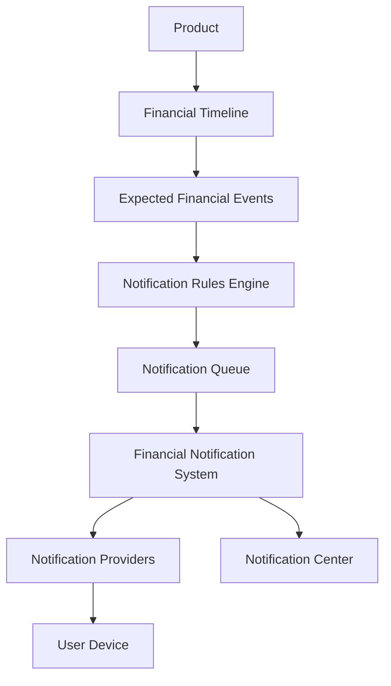

# Financial Notification System (FNS) Architecture

**Status:** Foundational domain — V1 (Data Schema V4)  
**Principle:** FNS never calculates financial schedules. It consumes Expected Financial Events from Financial Timeline only.

---

## 1. Responsibility Matrix

| Layer | Responsibility | Must NOT |
|-------|----------------|----------|
| **Products** | Financial information | Generate reminders |
| **Financial Timeline** | Expected events, activity, confirmation state | Deliver notifications |
| **Notification Rules Engine** | Transform events → reminder candidates | Calculate due dates |
| **Notification Queue** | Schedule, dedupe, retry, cancel obsolete | Format UI or deliver |
| **Financial Notification System** | Lifecycle, preferences, grouping, orchestration | Modify product state |
| **Notification Providers** | Platform delivery (browser, push, email…) | Business logic |

---

## 2. Architecture Flow



---

## 3. Folder Structure

```
src/notifications/
├── models/              # Domain types
├── rules/               # Reminder rules engine
├── queue/               # Queue management
├── core/                # FNS orchestrator, privacy, grouping
├── scheduler/           # Quiet hours, delivery timing
├── providers/           # Provider pattern + browser impl
├── center/              # Notification Center queries
├── history/             # Delivery history helpers
├── settings/            # Default preferences
├── services/            # Timeline sync service
├── hooks/               # React hooks
├── components/          # Notification Center + Settings UI
└── index.ts
```

`src/core/notifications/` remains the low-level browser utility used by the FNS browser provider adapter.

---

## 4. Queue Design

### States

`generated → queued → scheduled → delivered → opened | dismissed | snoozed | expired | failed | cancelled`

### Responsibilities

- **Fingerprint deduplication** — `${eventId}:${type}:${offset}`
- **Priority ordering** — critical > high > normal > low
- **Obsolete cancellation** — when timeline events become confirmed/skipped
- **Retry** — failed items re-queue up to max retries
- **Snooze** — re-deliver after `snoozedUntil`

### IndexedDB Store

`notificationQueue` — indexed by status, scheduled delivery, timeline ID

---

## 5. Rules Engine Design

`generateNotificationCandidates()` reads:

- Timeline events (status, dueDate, amount, eventType)
- Timeline metadata (product label from last confirmed snapshot)
- User reminder offsets (30, 15, 7, 3, 1, 0 days)
- Category enablement from settings

Generates notification types:

- Upcoming Due, Due Tomorrow, Due Today, Overdue
- Pending Confirmation, Missed Confirmation
- Extensible types for insurance, SIP, RD, subscriptions

**Never recalculates schedules** — due dates come from Financial Timeline only.

---

## 6. Provider Design

```typescript
interface FinancialNotificationProvider {
  id: string;
  isSupported(): boolean;
  requestPermission(): Promise<NotificationPermission | "unsupported">;
  deliver(payload: NotificationDeliveryPayload): Promise<void>;
}
```

### V1 Implementations

| Provider | Status |
|----------|--------|
| Browser | ✅ Implemented |
| Web Push | Stub (future) |
| Email | Stub |
| SMS | Stub |
| WhatsApp | Stub |
| Native Mobile | Stub |

Register via `createProviderRegistry()` — future cloud push plugs in without FNS changes.

---

## 7. Notification Center

Route: `/notifications`

Features:

- Unread / All / Snoozed / History filters
- Search
- Summary metrics (unread, today, overdue, snoozed)
- Actions: Snooze, Dismiss, Open Product
- Works fully offline from IndexedDB queue

Settings route: `/notifications/settings`

---

## 8. Settings Architecture

`FinancialNotificationSettings` (store: `notificationSettings`)

- Enable/disable notifications
- Privacy level (Private / Balanced / Detailed)
- Grouping on/off
- Quiet hours (22:00–07:00 default, critical override)
- Default provider
- Category toggles
- Reminder offset days
- Snooze duration

---

## 9. Privacy Design

| Level | Title Example | Body Example |
|-------|---------------|--------------|
| **Private** | Financial Reminder | Due Today |
| **Balanced** | EMI Due Today | HDFC Bank |
| **Detailed** | HDFC Bank EMI | ₹18,450 · Due Today · 2026-07-21 |

User consent required for detailed financial exposure.

---

## 10. Timeline Integration

`syncFinancialNotificationsFromTimeline()`:

1. Loads timelines + events from repository
2. Runs Rules Engine → Queue merge
3. Cancels obsolete reminders
4. Delivers due items via selected provider
5. Persists queue + history

Called on app bootstrap after schema migration and finance preload.

**Action flow:**

```
Notification Action → NotificationActionResult → Timeline Activity (caller) → Product State
```

FNS returns action descriptors; it never writes to timeline or product stores directly.

---

## 11. Platform Compatibility Matrix

| Platform | Notification Center | Browser Notifications | Offline Queue |
|----------|--------------------|-----------------------|---------------|
| Desktop Browser | ✅ | ✅ (with permission) | ✅ |
| Installed PWA | ✅ | ✅ (with permission) | ✅ |
| Android PWA | ✅ | ✅ (OS dependent) | ✅ |
| iOS Home Screen | ✅ | ⚠️ Limited / degraded | ✅ |

Platform limitations handled inside providers only.

---

## 12. Data Model (Schema V4)

| Store | Purpose |
|-------|---------|
| `notificationQueue` | Active notification items |
| `notificationHistory` | Delivery/action audit trail |
| `notificationSettings` | Global FNS preferences |

Backup format: optional additive fields (backward compatible with locked V1.0 backup envelope).

---

## 13. Automated Test Coverage

- Rules engine from timeline events
- Duplicate prevention
- Queue priority ordering
- Privacy formatting
- Smart grouping
- Quiet hours deferral
- Action results without timeline mutation
- Provider isolation
- V3→V4 migration idempotency
- Performance with 1000 events

---

## 14. Performance Analysis

- Rules engine: O(events × offsets) — typically small
- Queue merge: O(n) with fingerprint Set dedupe
- History trimmed to 5000 entries
- IndexedDB indexes for status and delivery time

---

## 15. Security Analysis

- All data local (IndexedDB)
- Privacy levels prevent unsolicited financial exposure
- No external notification services in V1
- Actions require explicit user interaction
- History append-only for audit

---

## 16. Future Extension Strategy

| Extension | Integration Point |
|-----------|-------------------|
| Cloud push | Register `WebPushProvider` |
| Multi-device sync | Extend backup snapshot fields |
| AI grouping | Replace `groupNotifications()` strategy |
| Per-product rules | Extend Rules Engine inputs |
| Email/SMS/WhatsApp | Register provider stubs |

No architectural redesign required — plug in providers and optional cloud sync.

---

## 17. Related Documents

- `docs/FINANCIAL_TIMELINE_ARCHITECTURE.md`
- `docs/ARCHITECTURE.md`
- `docs/BACKUP_SCHEMA.md`
