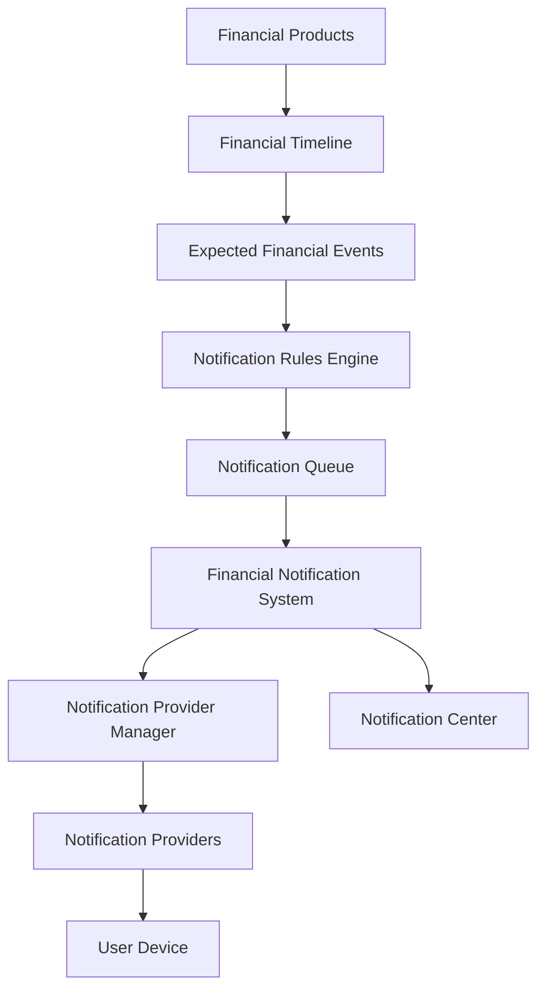
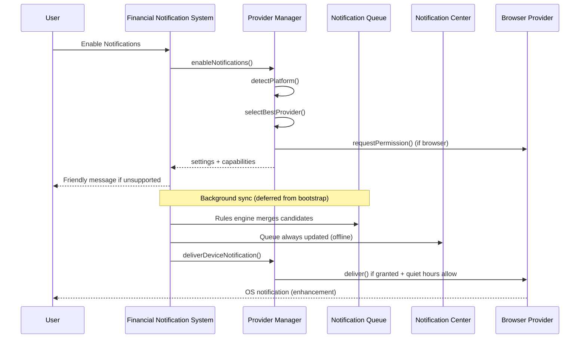
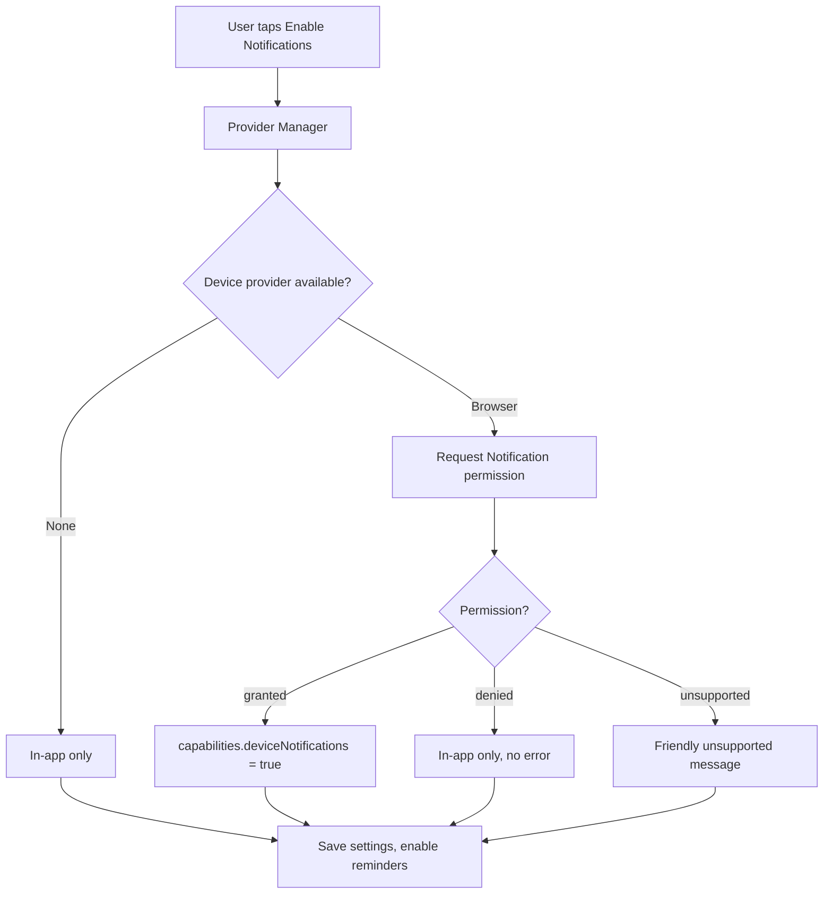
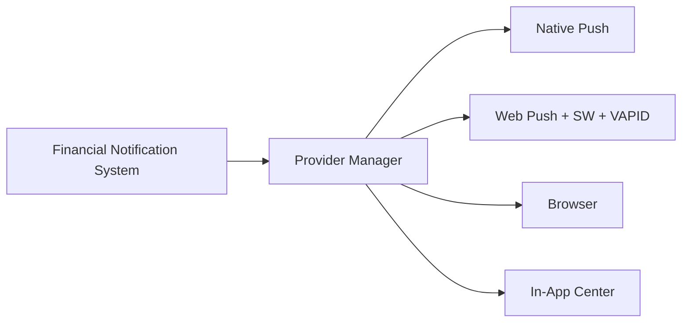

# Financial Notification System — Experience V1 (Architecture Freeze)

**Status:** Frozen — Notification Experience V1  
**Schema:** Data Schema V4  
**Principle:** Notifications are a **product feature**. Providers are **infrastructure details**. Users never choose delivery technology.

---

## 1. Core Philosophy

| User sees | System manages |
|-----------|----------------|
| Enable Notifications | Provider selection |
| Delivery: Automatic | Browser / Web Push / Native Push |
| In-App Reminders | Rules engine + queue |
| Device Notifications | Permission + platform detection |
| Notification Center | Single source of truth for reminders |

FNS never calculates financial schedules. It consumes Expected Financial Events from Financial Timeline only.

---

## 2. Architecture Diagram



**Mandatory chain:** Timeline → Rules → Queue → FNS → Provider Manager → Provider → Device.

Notification Center is **not** a fallback — every reminder exists there regardless of device delivery.

---

## 3. Notification Flow Diagram



---

## 4. Provider Manager Design

**Location:** `src/notifications/manager/`

| Module | Responsibility |
|--------|----------------|
| `platform-detection.ts` | **Only** place for platform detection |
| `provider-manager.ts` | Provider selection, enable/disable flow, device delivery |

### Platform detection

- Notification API availability
- Push API (detected, not used in V1)
- Service worker support
- Installed PWA (`display-mode: standalone`)
- Permission status

### Provider priority (internal)

1. Native Push — stub (future)
2. Web Push — stub (future, **skipped in V1**)
3. Browser Notification Provider — V1 implementation
4. In-App Notification Center — always available

First supported provider wins. Web Push is explicitly excluded from selection in V1.

### Key APIs

```typescript
class NotificationProviderManager {
  detectPlatform(): PlatformCapabilities;
  selectBestProvider(): FinancialNotificationProvider;
  selectDeviceProvider(): FinancialNotificationProvider | null;
  resolveCapabilities(settings): NotificationCapabilityState;
  enableNotifications(settings): Promise<EnableNotificationsResult>;
  disableNotifications(settings): Promise<FinancialNotificationSettings>;
  deliverDeviceNotification(payload, settings): Promise<boolean>;
}
```

---

## 5. Notification Center Design

**Route:** `/notifications`  
**Store:** `notificationQueue` (IndexedDB)

| Feature | Status |
|---------|--------|
| Unread / All / Snoozed / History | ✅ |
| Search | ✅ |
| Summary metrics | ✅ |
| Categories (via notification types) | ✅ |
| Actions (Snooze, Dismiss, Open Product) | ✅ |
| Offline | ✅ |

Every queued reminder appears in Notification Center even when device notifications fail or are denied.

**Settings route:** `/notifications/settings` — user-facing preferences only (no provider names).

---

## 6. Settings UI

### Profile (`/profile`)

Single **Notifications** section:

- **Status:** Enabled / Disabled
- **Delivery:** Automatic
- **Capabilities:** In-App Reminders, Notification Center, Device Notifications
- One action: **Enable Notifications** / **Disable**

Component: `ProfileNotificationsSection`

### Notification Settings (`/notifications/settings`)

| Setting | Exposed |
|---------|---------|
| Enable Notifications | ✅ |
| Quiet Hours | ✅ |
| Reminder Rules (offsets summary) | ✅ |
| Privacy Level | ✅ |
| Grouping | ✅ |
| Snooze Duration | ✅ |
| Provider selection | ❌ Never |
| Browser / Web Push labels | ❌ Never |

`FinancialNotificationSettings` fields:

- `enabled`, `deliveryMode: "automatic"`, `capabilities`, `activeProviderId` (internal)
- Legacy `defaultProviderId` migrated on read via `normalizeNotificationSettings()`

---

## 7. Permission Flow



Unsupported message (never an error):

> Your device doesn't support device notifications. You'll continue receiving reminders inside Finance Command Center.

---

## 8. Offline Behaviour

Without internet, FCC continues to:

1. Generate reminders from local Financial Timeline
2. Merge into Notification Queue (dedupe, cancel obsolete)
3. Display Notification Center
4. Show dashboard / timeline in-app reminders
5. Attempt browser notifications where permission was previously granted

No cloud infrastructure required. Bootstrap defers notification sync so startup never blocks.

---

## 9. Browser Notification Implementation

**Location:** `src/notifications/providers/browser-notification-provider.ts`

- Requests permission via Provider Manager (not UI)
- Shows notifications when supported and permitted
- Click actions open FCC and navigate to related product
- Gracefully no-ops when unsupported

Device delivery is gated by:

- `settings.enabled`
- `settings.capabilities.deviceNotifications`
- Quiet hours (non-critical deferred)
- Provider Manager permission check

---

## 10. Unsupported Device Behaviour

- No errors, no technical language in UI
- Capabilities show Device Notifications as unavailable
- In-App Reminders and Notification Center remain ✔
- Positive copy explains continued in-app reminders

---

## 11. Folder Structure

```
src/notifications/
├── models/
├── rules/               # Notification Rules Engine
├── queue/               # Notification Queue
├── core/                # FNS orchestrator
├── manager/             # Provider Manager + platform detection
├── providers/           # Isolated providers (browser, stubs)
├── center/              # Notification Center queries
├── history/
├── settings/
├── scheduler/           # Quiet hours
├── services/            # Timeline sync
├── hooks/
├── components/          # Center, Settings, Profile section
└── index.ts
```

---

## 12. Actions & Timeline Integration

Supported actions: Mark Paid, Open Product, Open Timeline, Snooze, Dismiss.

Actions return `NotificationActionResult` — FNS never mutates product state directly. Callers create Timeline Activities.

`syncFinancialNotificationsFromTimeline()`:

1. Load timelines + events
2. Normalize settings
3. Process via Rules Engine → Queue (skipped when disabled)
4. Deliver device notifications via Provider Manager
5. Persist queue + history

---

## 13. Testing Report

| Area | Tests |
|------|-------|
| Permission granted | Provider Manager enable flow |
| Permission denied | In-app continues, no device flag |
| Unsupported browser | Friendly message, in-app center selected |
| Installed PWA detection | Platform detection unit coverage |
| Browser notifications | Provider isolation + deliver mock |
| Notification Center | Queue, filters, hooks |
| Offline mode | Local timeline → queue without network |
| Queue dedupe / priority | Existing FNS tests |
| Grouping | Same-day group test |
| Timeline integration | End-to-end process test |
| Actions | Mark paid result descriptor |
| Migration | V3→V4 idempotency |
| Performance | 1000 events < 3s |
| Regression | 211 tests passing |

Run: `npm test`

---

## 14. Performance Review

- Rules engine: O(events × offsets)
- Queue merge: O(n) fingerprint dedupe
- History trimmed to 5000 entries
- Provider Manager singleton — no repeated registry allocation
- Notification sync deferred from bootstrap (non-blocking)
- IndexedDB indexes on status and scheduled delivery

---

## 15. Future Push Architecture

V1 explicitly does **not** implement Web Push (no VAPID, no subscriptions, no backend).

Future integration points:

| Provider | Integration |
|----------|-------------|
| Web Push | Register in `createInternalProviderRegistry()`, remove V1 skip in `selectBestProvider()` |
| Native Push | Implement stub in `providers/`, wins priority when `isSupported()` |
| Email / SMS / WhatsApp | Provider stubs already registered |

Provider Manager remains the single selection point. FNS and UI unchanged.



Cloud sync (optional future) extends backup snapshot fields — reminders still originate from local Timeline.

---

## 16. Related Documents

- `docs/FINANCIAL_TIMELINE_ARCHITECTURE.md`
- `docs/ARCHITECTURE.md`
- `docs/BACKUP_SCHEMA.md`
