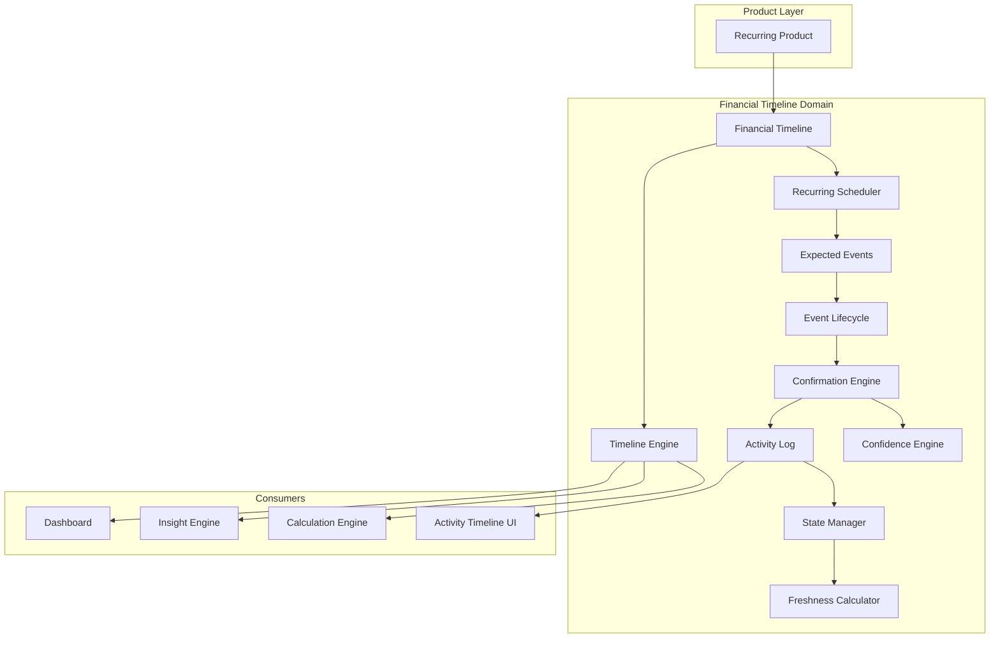

# Financial Timeline Architecture

**Status:** Foundational domain — V1 (Data Schema V3)  
**Audience:** Engineers, product architects, future contributors  
**Principle:** FCC never invents financial facts. Product state is derived from confirmed events only.

---

## 1. Problem Statement

Recurring financial products (loans, chits, insurance, SIPs, subscriptions) store static snapshots: outstanding balance, tenure, EMI, next due date. When users return after weeks or months, those numbers become stale — but FCC has no bank/SMS/API connection to verify payments.

**Solution:** Separate **Expected Events** from **Confirmed Events**. Calculations, dashboards, and insights use confirmed data only. Pending events surface for user review instead of silently mutating state.

---

## 2. Domain Architecture

```
Product (Loan, Chit, SIP, Insurance, …)
        │
        ▼
Financial Timeline          ← one per recurring product
        │
        ├── Recurring Scheduler     → generates expected events
        ├── Event Lifecycle           → scheduled → due → pending → confirmed|skipped|missed
        ├── Confirmation Engine       → strategy pattern (Manual, Ask Me, Smart Auto, Always Auto)
        ├── Confidence Engine         → weighted factors, no hardcoded IF trees
        ├── Activity Log              → immutable history; state never overwritten directly
        ├── State Manager             → derives last confirmed state from activities/events
        ├── Freshness Calculator      → Fresh / Good / Needs Review / Needs Attention / Stale
        └── Timeline Engine           → orchestrates all of the above on each refresh
                │
                ├── Calculation Engine (confirmed events only)
                ├── Insight Engine
                └── Dashboard projections
```

No recurring product may bypass this pipeline.

---

## 3. Architecture Diagram



---

## 4. Folder Structure

```
src/
├── shared/domain/financial-timeline/
│   ├── types.ts                 # Domain types, enums, settings
│   ├── event-lifecycle.ts       # Legal transition graph
│   └── index.ts
│
├── engines/financial-timeline/
│   ├── scheduler/
│   │   ├── date-utils.ts        # Calendar-safe date math (month-end, leap year)
│   │   └── recurring-scheduler.ts
│   ├── timeline/
│   │   ├── event-transition.ts  # Lifecycle advancement
│   │   └── timeline-engine.ts   # Main orchestrator
│   ├── activity/
│   │   └── activity-log.ts
│   ├── state/
│   │   └── state-manager.ts     # Confirmed-only derivation
│   ├── confirmation/
│   │   └── confirmation-engine.ts  # Strategy pattern
│   ├── confidence/
│   │   └── confidence-engine.ts    # Weighted factor scoring
│   ├── freshness/
│   │   └── freshness-calculator.ts
│   ├── settings/
│   │   └── defaults.ts
│   ├── migration/
│   │   └── bootstrap-timeline.ts   # V2 → V3 product bootstrap
│   ├── financial-timeline.test.ts
│   └── index.ts
│
├── storage/
│   ├── indexeddb/database.ts    # Stores: financialTimelines, timelineEvents,
│   │                            #         timelineActivities, timelineSettings
│   └── migration/
│       └── migrate-v2-to-v3.ts
│
└── repositories/
    └── indexeddb-finance-repository.ts  # CRUD + chained V1→V2→V3 migration
```

---

## 5. Data Model

### IndexedDB Stores (Schema V3, DB version 8)

| Store | Key | Indexes | Purpose |
|-------|-----|---------|---------|
| `financialTimelines` | `id` | `by-product-id` | One timeline per product |
| `timelineEvents` | `id` | `by-timeline-id` | Expected + confirmed events |
| `timelineActivities` | `id` | `by-timeline-id` | Immutable activity log |
| `timelineSettings` | `id` | — | Global confirmation preferences |

### Core Entities

- **FinancialTimeline** — links `productTypeId` + `productId`, holds schedule, last confirmed state, freshness
- **TimelineEvent** — recurring occurrence with strict lifecycle status
- **TimelineActivity** — every user-visible change (created, confirmed, skipped, prepayment, …)
- **FinancialTimelineSettings** — default confirmation mode, smart-auto threshold, reminder thresholds

### FinanceDataSnapshot (additive)

V3 adds optional fields to backup snapshots (backward compatible with locked backup format V1.0):

- `financialTimelines?`
- `timelineEvents?`
- `timelineActivities?`
- `timelineSettings?`

---

## 6. Database Migration Strategy

**Chain:** V1 → V2 (commitments/income) → V3 (financial timelines)

**V2 → V3 (`migrateSchemaV2ToV3`):**

1. Idempotent — skips if timelines already exist on V3
2. For each active loan: `bootstrapTimelineFromLoan()` — preserves outstanding, tenure, payments as confirmed events + activities
3. For each chit: `bootstrapTimelineFromChit()` — preserves contribution schedule
4. Writes default `FinancialTimelineSettings`
5. Updates `schemaMeta.schemaVersion` to `3`

No manual user action required. Existing payment history becomes confirmed timeline events.

---

## 7. Event Lifecycle

```
Scheduled → Due → Pending Confirmation → Confirmed
                                      → Skipped
                                      → Missed
```

**Hard rule:** No transition from `scheduled` directly to `confirmed`. Enforced by `assertTimelineEventTransition()`.

Past-due generated events enter `pending_confirmation`. They never affect outstanding, tenure, or dashboard calculations until confirmed.

---

## 8. Confirmation Strategy Pattern

| Mode | Behavior |
|------|----------|
| **Manual** | User confirms every event; no automation |
| **Ask Me** (default) | Review dialog when pending events accumulate |
| **Smart Auto** | High-confidence events auto-confirm; low-confidence → Ask Me |
| **Always Auto** | All pending events auto-confirm after due date (advanced users) |

Strategies implement `ConfirmationStrategy` and register via `registerConfirmationStrategy()` for future modes (e.g. AI Assisted) without modifying existing code.

---

## 9. Confidence Engine

Weighted factor model (not hardcoded IF trees):

| Factor | Weight | Inputs |
|--------|--------|--------|
| Days since confirmation | 0.30 | `lastConfirmedState.asOfDate` |
| Pending volume | 0.25 | Count of pending events |
| Payment consistency | 0.20 | Historical missed count |
| Product status | 0.15 | active / archived / closed |
| Strategy alignment | 0.10 | User-selected mode |

Output: score 0–100, level `high` / `medium` / `low`. Smart Auto confirms only when `score >= smartAutoThreshold` (default 80).

---

## 10. Timeline Generation Logic

`generateExpectedTimelineEvents()` uses:

- Frequency: monthly, quarterly, half-yearly, yearly, weekly, custom
- `startDate`, `endDate`, `dueDayOfMonth`, `installmentCount`
- Month-end clamping via `addMonthsPreservingDueDay()` (handles 28/29/30/31, leap years)
- Events after `fromDate` (last confirmed) up to `referenceDate`

Status assignment at generation:

- Before reference date → `pending_confirmation`
- On reference date → `due`
- After reference date → `scheduled`

---

## 11. Activity Log Design

Every financial change appends a `TimelineActivity`:

- Product created / edited
- Event confirmed / skipped / missed
- Prepayment, outstanding update, interest change, tenure update

**State rule:** Current product state is always derived from confirmed events + activities. Never overwrite loan/chit records directly from scheduler output.

---

## 12. Dashboard Integration

`TimelineDashboardSummary` exposes:

- `confirmedCount`, `pendingConfirmationCount`, `missedCount`
- `lastUpdatedLabel`, `needsReview`

Dashboard surfaces pending confirmations prominently instead of showing stale tenure/outstanding silently.

---

## 13. Product Integration

Each recurring product owns exactly one `FinancialTimeline`:

| Product | Event Type | Schedule Source |
|---------|------------|-----------------|
| Home / Vehicle / Personal / Education / Business Loan | EMI | `monthlyEmi`, `emiPaymentDay`, `remainingTenureMonths` |
| Gold Loan | Renewal | Same fields, renewal event type |
| Chit | Contribution | `monthlyContribution`, chit duration |
| Future: Insurance, SIP, RD, Subscriptions | Premium / Contribution / Installment | Product-specific schedule adapter |

Adding a new product type requires: define schedule + link product ID. Timeline handles the rest.

---

## 14. Automated Test Coverage

Tests in:

- `src/engines/financial-timeline/financial-timeline.test.ts`
- `src/storage/migration/migrate-v2-to-v3.test.ts`

Scenarios covered:

- Event lifecycle legality
- Loan due yesterday, 3-day absence, 120-day absence
- Leap year and month-end dates (28/29/30/31)
- Confirmation strategies (Manual, Ask Me, Smart Auto, Always Auto)
- Confidence degradation on long absence
- Confirmed-only tenure derivation (pending events excluded)
- Skipped / missed terminal states
- Migration bootstrap from loans + payments
- Performance with hundreds of generated events
- Reference date isolation (device clock independence)

---

## 15. Performance Considerations

- Event generation capped at `installmentCount ?? 600` per run
- Timeline processing is pure functions — suitable for worker offload later
- IndexedDB indexes on `timelineId` and `productId` for O(1) lookups
- Batch writes via repository transactions on migration

---

## 16. Security Considerations

- All data local (IndexedDB) — no external verification surface
- Auto-confirm never runs without explicit strategy selection
- Smart Auto threshold user-configurable
- Backup restore validates timeline settings shape; timeline arrays optional for V1/V2 backups
- Activity log append-only by convention — no delete API exposed

---

## 17. Future Extension Strategy

| Extension | Integration Point |
|-----------|-------------------|
| New product type | `build*Schedule()` + bootstrap adapter |
| AI Assisted confirmation | `registerConfirmationStrategy("ai_assisted", …)` |
| EMI holiday | `skipped` transition + activity kind |
| Bank feed (future) | Confirmation adapter — feeds `confirmed` with verified source metadata |
| Cloud sync | Extend `FinanceDataSnapshot` optional fields; backup format unchanged |
| Per-product confirmation mode | `FinancialTimeline.confirmationMode` overrides global settings |

---

## 18. Settings (Global)

`FinancialTimelineSettings` (store: `timelineSettings`, id: `primary`):

- `defaultConfirmationMode` — Manual | Ask Me | Smart Auto | Always Auto
- `smartAutoThreshold` — minimum confidence score (default 80)
- `pendingReminderDays`, `reviewOverdueDays`
- `showFreshnessIndicator`

Future settings integrate by extending this entity — no engine rewrites required.

---

## 19. Trust Invariants (Non-Negotiable)

1. Pending events never affect outstanding, tenure, health, insights, or dashboard totals
2. Expected events never silently become confirmed except via explicit strategy
3. Last confirmed state is always traceable to an activity
4. Migration preserves all existing financial data
5. UI Foundation V1.0 remains unchanged — timeline is domain/engine layer first

---

## 20. Related Documents

- `docs/ARCHITECTURE.md` — application-wide boundaries
- `docs/handbook/011-data-model.md` — legacy data model
- `docs/BACKUP_SCHEMA.md` — locked backup format (V3 fields are additive optional)
- `docs/SESSION_HANDOFF.md` — session state and recent work
